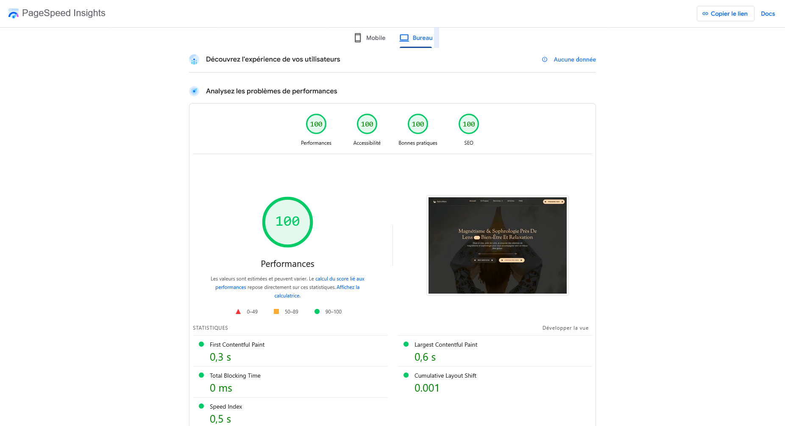

# alexia-energies

Application web de bien-être et formations, développée dans le cadre du Titre Pro Développeur Web & Web Mobile (mai-juillet 2025) pendant mon stage en freelance.

Démo en ligne : [alexia-energies.vercel.app](https://alexia-energies.vercel.app/)

---

Il s'agit d'un projet [Next.js](https://nextjs.org) initialisé avec [`create-next-app`](https://nextjs.org/docs/app/api-reference/cli/create-next-app).

## Présentation

Plateforme dédiée au bien-être, proposant :

- Un site vitrine (magnétisme, sophrologie, human design)
- Prise de rendez-vous via Calendly (présentiel/distanciel)
- Interface d’administration (gestion utilisateurs, articles, newsletter)

---

## Fonctionnalités principales

- Pages publiques : Accueil, Qui suis-je, Services, Articles, FAQ, Contact
- Prise de rendez-vous intégrée (Calendly)
<!-- - Espace formation privé (achat via Stripe, accès sécurisé, contenus multimédias) -->
- Administration complète (utilisateurs, articles, newsletters)
- Authentification sécurisée (BcryptJs, JWT)
- Emails transactionnels (Resend, Email.js)
- Site responsive et SEO friendly

## Stack technique

| Élément          | Technologie          |
| ---------------- | -------------------- |
| Framework        | Next.js              |
| Base de données  | Neon (PostgreSQL)    |
| ORM              | Prisma               |
| Authentification | BcryptJs, JWT        |
| Emails           | Email.js, Resend     |
| Formulaires      | React Hook Form, Zod |
| Déploiement      | Vercel               |

---

## Vocabulaire / Définitions

- **Framework** : Ensemble d’outils et de conventions facilitant le développement d’applications (ex : Next.js).
- **Next.js** : Framework basé sur React pour créer des applications web performantes, avec rendu côté serveur, génération statique, routage simplifié, etc.
- **Base de données** : Système permettant de stocker et organiser les données (ex : PostgreSQL).
- **ORM (Object-Relational Mapping)** : Outil qui simplifie les interactions entre le code et la base de données (ex : Prisma).
- **Authentification** : Processus permettant de vérifier l’identité d’un utilisateur (ex : BcryptJs pour le hachage des mots de passe, JWT pour les jetons d’accès).
- **Paiement** : Intégration de solutions pour accepter des paiements en ligne (ex : Stripe).
- **Emails transactionnels** : Envoi automatique d’emails liés aux actions des utilisateurs (ex : Email.js, Resend).
- **Formulaires** : Outils pour gérer la saisie et la validation des données utilisateurs (ex : React Hook Form, Zod).
- **Déploiement** : Mise en ligne de l’application sur un serveur ou une plateforme cloud (ex : Vercel).

---

## Les Hooks

### Qu’est-ce qu’un hook ? À quoi ça sert ?

Un **hook** en React est une fonction spéciale qui permet d’ajouter des fonctionnalités avancées (comme la gestion de l’état ou des effets de bord) aux composants fonctionnels, sans avoir besoin d’utiliser des classes. Les hooks rendent le code plus simple, plus modulaire et plus facile à maintenir. Par exemple, grâce aux hooks, on peut gérer l’état local (`useState`), effectuer des actions après le rendu (`useEffect`), ou gérer des formulaires (`useForm`).

### Principaux hooks utilisés dans ce projet

- **useState** : Permet de déclarer une variable d’état locale dans un composant fonctionnel. On l’utilise pour stocker et modifier des valeurs dynamiques, par exemple le contenu d’un champ de formulaire ou le nombre de clics sur un bouton.
- **useEffect** : Sert à exécuter du code en réponse à certains événements du cycle de vie du composant (montage, mise à jour, démontage). Il est utilisé pour effectuer des effets de bord comme des appels API, la gestion d’événements ou la modification du DOM après le rendu.
- **useForm** : Proposé par la librairie React Hook Form, ce hook simplifie la gestion des formulaires dans React. Il permet de gérer la validation, la collecte des données et les erreurs de manière efficace, tout en réduisant la quantité de code nécessaire.

En résumé, les hooks sont essentiels pour gérer l’état, les effets secondaires et la logique des formulaires dans les applications React modernes, tout en gardant le code clair et modulaire.

## Qu’est-ce que la logique métier ?

La **logique métier** (ou « business logic ») désigne l’ensemble des règles, traitements et processus propres au fonctionnement d’une application, indépendamment de l’interface utilisateur ou de la gestion des données. Elle définit comment les données sont manipulées, validées et comment les fonctionnalités principales répondent aux besoins spécifiques du domaine (ex : gestion des réservations, calculs de tarifs, validation d’accès à une formation). Séparer la logique métier du reste du code permet d’avoir une application plus claire, maintenable et évolutive.

---

## Cahier des charges

Le cahier des charges complet du projet est disponible dans le fichier [Cachier des charges](./cahier-des-charges.md).

Résumé : développement d’une application web de bien-être avec site vitrine, prise de rendez-vous, espace formation en ligne (privé après paiement), et interface d’administration. Voir le fichier pour le détail des pages, fonctionnalités et contraintes techniques.

## Limites / Non réalisé

- L’espace formation en ligne, le paiement Stripe et la gestion des chapitres n’ont pas pu être réalisés par manque de temps.
- Seules les parties site vitrine, prise de rendez-vous, articles, FAQ, contact et administration de base sont fonctionnelles.

---

## Audits Lighthouse

Résultats des audits Lighthouse sur la version Desktop et Mobile :

### Desktop



### Mobile


---

## Démarrage

Pour commencer, lancez le serveur de développement :

```bash
npm run dev
# ou
yarn dev
# ou
pnpm dev
# ou
bun dev
```

Ouvrez [http://localhost:3000](http://localhost:3000) dans votre navigateur pour voir le résultat.

Vous pouvez commencer à modifier la page en éditant le fichier `app/page.js`. La page se met à jour automatiquement lors de vos modifications.

Ce projet utilise [`next/font`](https://nextjs.org/docs/app/building-your-application/optimizing/fonts) pour optimiser et charger automatiquement [Geist](https://vercel.com/font), une nouvelle famille de polices créée par Vercel.

## En savoir plus

Pour en savoir plus sur Next.js, consultez les ressources suivantes :

- [Documentation Next.js](https://nextjs.org/docs) - découvrez les fonctionnalités et l'API de Next.js.
- [Apprendre Next.js](https://nextjs.org/learn) - un tutoriel interactif sur Next.js.

Vous pouvez également consulter [le dépôt GitHub de Next.js](https://github.com/vercel/next.js) - vos retours et contributions sont les bienvenus !

## Déployer sur Vercel

Le moyen le plus simple de déployer votre application Next.js est d'utiliser la [plateforme Vercel](https://vercel.com/new?utm_medium=default-template&filter=next.js&utm_source=create-next-app&utm_campaign=create-next-app-readme) créée par les auteurs de Next.js.

Consultez notre [documentation sur le déploiement Next.js](https://nextjs.org/docs/app/building-your-application/deploying) pour plus de détails.

---
